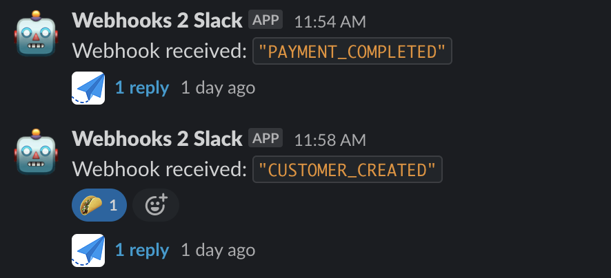

# Webhooks 2 Slack

This is a Slack application. It listens to webhooks (specifically, Rapyd webhoooks) and forwards the content of the webhook body to a Slack channel.

The application posts a message with the name of the webhook (in this case, present in a field called "type" within a JSON object. The app then replays to that message with the body of the webhook. The headers of the webhooks are not sent to slack.

---

### Webhook Body

In this particular case, I need to listen to webhooks with the following format:

```JSON
{
  "id": "wh_XXXXX",
  "type": "WEBHOOK_TYPE",
  "data": {
    "id": "obj_XXXXXX",
    .
    .
    .
  }
}
```

### Slack Messages

The content of the webhook is posted in a channel called #webhooks within the Slack workspace.

First, a message with the name of the webhook is posted. Then a reply is posted within that thread:



### Deployment

The application uses an environment variable called `SLACK_TOKEN` that needs to be present in the server. The variable should contain the token of the Slack application.

I deployed the application to a Heroku dyno.

~ Isaac Benitez
